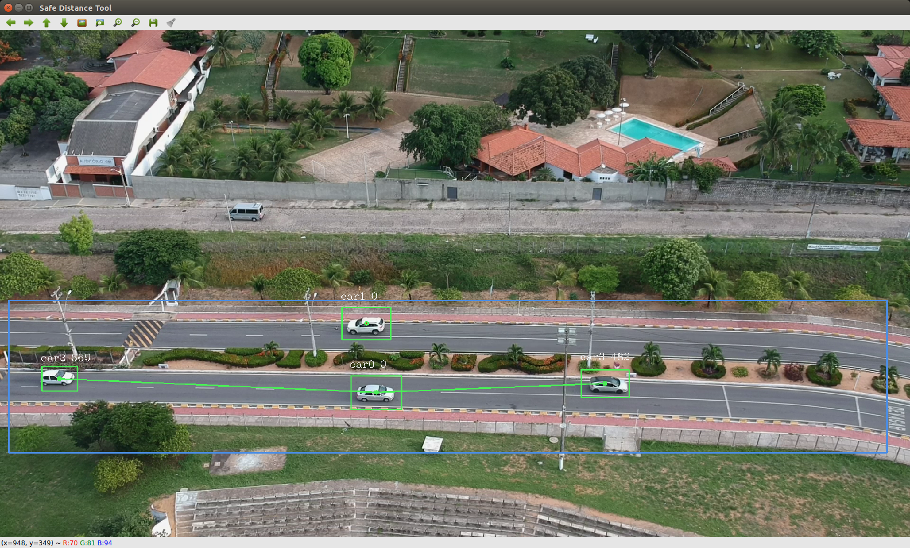

# Safe distance between moving vehicles



The frames captured from the user provided video are then fed into the [YOLOv3](#using-yolov3-for-detection) or [YOLOv4](#using-yolov4-for-detection) algorithm, where the vehicles detection is done. With the YOLO detections our algorithm then calculates the center of mass of each bounding box founded for then using the Euclidean method calculate the distance to the closest car. The detected class, index and distance to the closest detected vehicle are respectively shown above each bounding box.

This project **was developed and tested for Ubuntu 16.04 and 18.04.**

Knowledge in the darknet framework and YOLO object detector is required, further reading can be found [here](https://pjreddie.com/darknet/).

The darknet framework present here is a reimplementation based in [pjreddie](https://github.com/pjreddie/darknet) and [AlexeyAB](https://github.com/AlexeyAB/darknet/) work.

The darknet's python wrapper here present is based in [madhawav](https://github.com/madhawav/YOLO3-4-Py) work.


## Using YOLOv3 for detection

### Requirements

* GCC/G++: [Install Guide](https://github.com/vanluwin/enviroment#change-gccg-version)

* OpenCV: [Install Guide](https://github.com/vanluwin/enviroment/#install-opencv)

* Nvidia Drivers (only for GPU acceleration): [Install Guide](https://github.com/vanluwin/enviroment/#install-nvidia-gpu-drivers)

* CUDA (only for GPU acceleration): [Install Guide](https://github.com/vanluwin/enviroment#install-cuda)

* CuDNN (only for GPU acceleration): [Install Guide](https://github.com/vanluwin/enviroment#install-cudnn)

### Using a python environment

This section is a guide to the instalations of a python environment with the requirements of this repository.

First install [Anaconda](https://www.anaconda.com/distribution/) or [Miniconda](https://docs.conda.io/en/latest/miniconda.html), both of them give you similar results but the latter requires less disk space.

Now create a python virtual environment and install the required packages following the commands. Substitute **<environment_name>** with a name for your environment

```console
user@computer:~$ conda create -n <environment_name> anaconda python=3
user@computer:~$ conda activate <environment_name>
(<environment_name>) user@computer:~$ conda install -c loopbio -c conda-forge -c pkgw-forge ffmpeg gtk2 opencv numpy scipy matplotlib cython pip
(<environment_name>) user@computer:~$ pip install yolo34py-gpu
```

### Installing Darknet

First clone the [repository](First clone the [repository](https://gitlab.com/helton.maia/proj-cnn-vant) and complie the source code. This can be accomplished by:

```console
user@computer:~ $ git clone https://gitlab.com/helton.maia/proj-cnn-vant
user@computer:~ $ cd proj-cnn-vant/darknet
user@computer:~/proj-cnn-vant/darknet $ make
```

### Using the scripts

To use the provided scripts make sure to activate your python environment, that can be acomplished by:

```console
user@computer:~$ conda activate <environment_name>
```

### The Safe Distance Analyser

This script aims to track and detect the safe distance between vehicles. Usage:

```console
(<environment_name>) user@computer:~/proj-cnn-vant $ python safeDistanceTool.py cfg data weight video output [-h] [--debug] [--save-video]
```

## Using YOLOv4 for detection

### Requirements

* Nvidia Drivers (only for GPU acceleration): [Install Guide](https://github.com/vanluwin/enviroment/#install-nvidia-gpu-drivers)

* CUDA (only for GPU acceleration): [Install Guide](https://github.com/vanluwin/enviroment#install-cuda)

* CuDNN (only for GPU acceleration): [Install Guide](https://github.com/vanluwin/enviroment#install-cudnn)

### Using a python environment

This section is a guide to the instalations of a python environment with the requirements of this repository.

First install [Anaconda](https://www.anaconda.com/distribution/) or [Miniconda](https://docs.conda.io/en/latest/miniconda.html), both of them give you similar results but the latter requires less disk space.

Now create a python virtual environment and install the required packages following the commands. Substitute **<environment_name>** with a name for your environment

```console
user@computer:~$ conda create -n <environment_name> anaconda python=3
user@computer:~$ conda activate <environment_name>
(<environment_name>) user@computer:~$ conda install -c loopbio -c conda-forge -c pkgw-forge ffmpeg gtk2 opencv numpy scipy matplotlib pip
(<environment_name>) user@computer:~$ pip install tensorflow yolov4
```

### Using the scripts

To use the provided scripts make sure to activate your python environment, that can be acomplished by:

```console
user@computer:~$ conda activate <environment_name>
```

### The Safe Distance Analyser

This script aims to track and detect the safe distance between vehicles. Usage:

```console
(<environment_name>) user@computer:~ $ git clone https://github.com/vitoryeso/ECT-proj-cnn-vant.git
(<environment_name>) user@computer:~ $ cd proj-cnn-vant/safe_distance
(<environment_name>) user@computer:~/proj-cnn-vant/safe_distance $ python safeDistanceToolYolov4.py weight video output [--iou-thresh IOU_THRESH] [--score-thresh SCORE_THRESHi] [-h] [--debug] [--save-video]
```

## Weights

The latest weights used in the work can be downloaded here:

[YOLOv4 416x416](https://drive.google.com/file/d/1-1EfrW3xv_3vlkfXO-fRrChGJL60fGy3/view?usp=sharing)

[YOLOv4 Tiny 608x608](https://drive.google.com/file/d/100he6HKSCWE68r_TCNX4Gzf7KQpBm2dr/view?usp=sharing)

**Required arguments**:

* *cfg*: Path to yolo configuration file. (only for YOLOv3)
* *data*: Path to network data file. (only for YOLOv3)
* *weight*: Path to the weights file.
* *video*: Path to source video.
* *output*: Name of the log file to be produced.

**Optional arguments**:

* *-h*, *--help*: Show this help message and exit
* *--debug*: Shows a window with debugging information during video classification.
* *--save-video*: Create a video file with the analysis result.
* *--iou-thresh*: Set the [IOU](https://www.pyimagesearch.com/2016/11/07/intersection-over-union-iou-for-object-detection/) threshold for consider a detection (only for YOLOv4). Default is 0.4.
* *--score-thresh*: Set the probability score threshold for consider a detection (only for YOLOv4). Default is 0.6.

**Avalible commands**:

* *space* - Pause the video stream
* *q*, *esc* - Finish the execution
